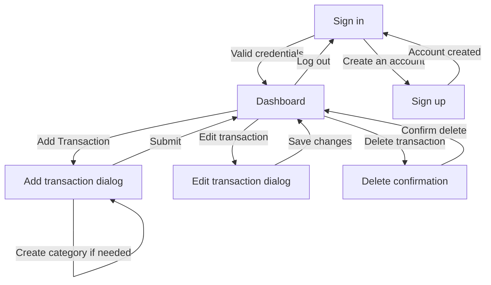

# Dossier de conception - myBank

Projet #6 - CDA 3eme annee - L'Ecole Multimedia - 2025

## Etat du document

Ce document regroupe les elements attendus dans le dossier de conception du projet myBank.
Il a ete prepare a partir du brief projet et du code existant.

Elements deja generes depuis le projet :

- reformulation de la demande client ;
- adresse du depot GitHub ;
- synthese fonctionnelle ;
- description des ecrans implementes ;
- references vers les diagrammes UML existants ;
- schema de base de donnees decrit depuis les entites Doctrine et migrations ;
- description de l'infrastructure Docker ;
- description de la CI GitHub Actions ;
- preparation du deploiement VPS et du workflow CD ;
- plan de tests ;
- README attendu et etat actuel ;
- liste des captures d'ecran a fournir.

Elements a completer apres production des assets :

- adresse de deploiement publique apres configuration DNS/hostname ;
- activation des secrets GitHub Actions pour executer le workflow CD sur le VPS.

Note sur Figma :

- fichier Figma cree : <https://www.figma.com/design/HLG1xiVYfVRPLx4u644AnR>
- pages creees : `00 - Overview`, `01 - Zoning & Wireframes`, `02 - Maquettes` ;
- les zonings, wireframes et maquettes sont presents sous forme editable ;
- le plan Figma Starter a bloque la finalisation par quota MCP avant une verification complete et avant d'eventuelles retouches supplementaires.

## 1. Reformulation de la demande client

BankBank souhaite developper myBank, une application web simple et intuitive permettant a des particuliers, notamment des jeunes utilisateurs, de suivre leurs finances personnelles.

L'application doit permettre a un utilisateur de se connecter a son compte, puis de gerer ses operations financieres. Une operation correspond a un mouvement d'argent, positif ou negatif, et contient un libelle, un montant, une date et une ou plusieurs categories. Les categories permettent de classer les operations et de mieux comprendre la repartition des depenses.

Le produit attendu est une application web en anglais, utilisable depuis un navigateur, responsive sur mobile, tablette et desktop, et respectant la charte graphique fournie par BankBank :

- typographie : Montserrat ;
- couleur principale : `#156064` ;
- couleur secondaire : `#00c49a` ;
- couleur d'accent : `#f8e16c`.

Le projet doit etre developpe avec React pour le frontend et Symfony pour le backend. Il doit etre versionne avec GitHub, conteneurise avec Docker, testable rapidement et accompagne d'une demarche CI/CD.

## 2. Adresse GitHub

Depot GitHub :

<https://github.com/martin-dinahet/fullstack-banking-app>

Branche principale observee :

`main`

## 3. Documents de conception de l'interface

### 3.1 Zoning

Statut : genere dans Figma, verification finale limitee par quota MCP.

Fichier Figma :

<https://www.figma.com/design/HLG1xiVYfVRPLx4u644AnR>

Page :

`01 - Zoning & Wireframes`

Les zonings couvrent :

- ecran de connexion ;
- ecran d'inscription ;
- dashboard ;
- formulaire d'ajout d'une transaction ;
- formulaire de modification d'une transaction ;
- confirmation de suppression d'une transaction.

### 3.2 Wireframes

Statut : genere dans Figma, verification finale limitee par quota MCP.

Fichier Figma :

<https://www.figma.com/design/HLG1xiVYfVRPLx4u644AnR>

Page :

`01 - Zoning & Wireframes`

Les wireframes presentent la structure fonctionnelle avant application complete du style final.

Ecrans recommandes :

- sign in ;
- sign up ;
- dashboard vide ;
- dashboard avec operations ;
- dialog add transaction ;
- dialog edit transaction ;
- confirmation delete transaction.

### 3.3 Maquette Figma

Statut : generee dans Figma, verification finale limitee par quota MCP.

Fichier Figma :

<https://www.figma.com/design/HLG1xiVYfVRPLx4u644AnR>

Page :

`02 - Maquettes`

Les maquettes haute fidelite sont construites pour correspondre a l'application reelle : charte graphique, typographie Montserrat, couleurs BankBank, ecrans d'authentification, dashboard vide, dashboard avec operation, ajout, modification et suppression.

Limite assumee :

Le quota Figma MCP du plan Starter a ete atteint pendant la verification. Le fichier existe et contient les planches, mais il reste conseille de faire une revue visuelle manuelle dans Figma avant rendu final.

### 3.4 Schema d'enchainement des ecrans

Statut : a completer sous forme graphique.

Enchainement fonctionnel actuel :



## 4. Schemas de conception UML

Des diagrammes sont deja presents dans le projet :

- `docs/diagrammes/diagramme-uml-cas-utilisation.png`
- `docs/diagrammes/diagramme-uml-classes.png`
- `docs/diagrammes/diagramme-uml-relationnel-entites.png`
- `docs/diagrammes/diagramme-uml-sequence.png`

Ces fichiers devront etre integres dans la version finale du dossier de conception.

### 4.1 Cas d'utilisation

Acteurs :

- utilisateur authentifie ;
- visiteur non authentifie.

Principaux cas d'utilisation :

- creer un compte ;
- se connecter ;
- consulter le dashboard ;
- visualiser ses operations ;
- creer une operation ;
- modifier une operation ;
- supprimer une operation ;
- creer une categorie depuis le formulaire d'operation ;
- consulter la repartition par categorie ;
- se deconnecter.

### 4.2 Classes principales

Classes backend principales :

- `User`
- `Operation`
- `Category`

Relations :

- un utilisateur possede plusieurs operations ;
- un utilisateur possede plusieurs categories ;
- une operation appartient a un utilisateur ;
- une categorie appartient a un utilisateur ;
- une operation peut etre liee a plusieurs categories ;
- une categorie peut etre liee a plusieurs operations.

## 5. Schemas de la base de donnees

Le schema de base de donnees est gere par Doctrine et les migrations Symfony.

Tables principales :

### `user`

| Champ | Type | Description |
| --- | --- | --- |
| `id` | INT | Identifiant unique |
| `email` | VARCHAR(180) | Email unique de l'utilisateur |
| `roles` | JSON | Roles Symfony |
| `password` | VARCHAR(255) | Mot de passe hash |

### `operation`

| Champ | Type | Description |
| --- | --- | --- |
| `id` | INT | Identifiant unique |
| `label` | VARCHAR(255) | Libelle de l'operation |
| `amount` | NUMERIC(10,2) | Montant positif ou negatif |
| `date` | DATETIME | Date de l'operation |
| `user_id` | INT | Proprietaire de l'operation |

### `category`

| Champ | Type | Description |
| --- | --- | --- |
| `id` | INT | Identifiant unique |
| `title` | VARCHAR(255) | Titre de la categorie |
| `user_id` | INT | Proprietaire de la categorie |

### `operation_categories`

| Champ | Type | Description |
| --- | --- | --- |
| `operation_id` | INT | Operation liee |
| `category_id` | INT | Categorie liee |

Cette table gere la relation many-to-many entre operations et categories.

## 6. Depot GitHub, Docker, CI et code applicatif

### 6.1 Code de l'application

Structure principale :

- `frontend/` : application React, TypeScript, Vite, TanStack Query, React Router, Tailwind CSS, shadcn/ui ;
- `backend/` : API Symfony, Doctrine ORM, LexikJWTAuthenticationBundle ;
- `compose.yaml` et `compose.dev.yaml` : orchestration Docker ;
- `compose.prod.yaml` : orchestration Docker de production ;
- `nginx.conf` et `nginx.dev.conf` : reverse proxy ;
- `deploy/reverse-proxy/compose.yaml` : reverse proxy Traefik partage ;
- `.github/workflows/ci.yaml` : pipeline CI ;
- `.github/workflows/deploy.yaml` : pipeline CD.

### 6.2 Frontend

Technologies :

- React 19 ;
- TypeScript ;
- Vite ;
- React Router ;
- TanStack Query ;
- Tailwind CSS ;
- shadcn/ui ;
- Biome ;
- Vitest.

Routes principales :

| Route | Description |
| --- | --- |
| `/sign-in` | Connexion utilisateur |
| `/sign-up` | Creation de compte |
| `/` | Dashboard protege |

Fonctionnalites frontend implementees :

- formulaires de connexion et d'inscription ;
- protection des routes par etat d'authentification ;
- dashboard avec solde, revenus, depenses et compteur d'operations ;
- liste des transactions recentes ;
- creation d'une transaction ;
- modification d'une transaction ;
- suppression d'une transaction avec confirmation ;
- creation d'une categorie depuis le formulaire de transaction ;
- affichage de la repartition par categorie ;
- toasts de retour utilisateur ;
- theme clair/sombre.

### 6.3 Backend

Technologies :

- Symfony ;
- PHP 8.4 ;
- Doctrine ORM ;
- MySQL 8 ;
- JWT pour l'authentification.

Endpoints principaux :

| Methode | Endpoint | Description |
| --- | --- | --- |
| `POST` | `/api/register` | Creation de compte |
| `POST` | `/api/login` | Connexion |
| `POST` | `/api/logout` | Deconnexion |
| `GET` | `/api/me` | Profil utilisateur connecte |
| `GET` | `/api/categories` | Liste des categories |
| `POST` | `/api/categories` | Creation d'une categorie |
| `GET` | `/api/categories/{id}` | Detail d'une categorie |
| `PATCH/PUT` | `/api/categories/{id}` | Modification d'une categorie |
| `DELETE` | `/api/categories/{id}` | Suppression d'une categorie |
| `GET` | `/api/operations` | Liste des operations |
| `POST` | `/api/operations` | Creation d'une operation |
| `GET` | `/api/operations/summary` | Resume financier |
| `GET` | `/api/operations/{id}` | Detail d'une operation |
| `PATCH/PUT` | `/api/operations/{id}` | Modification d'une operation |
| `DELETE` | `/api/operations/{id}` | Suppression d'une operation |

### 6.4 Docker

Services Docker :

| Service | Role |
| --- | --- |
| `frontend` | Serveur Vite pour l'application React |
| `backend` | Application Symfony |
| `db` | Base MySQL 8 |
| `nginx` | Reverse proxy exposant l'application sur `localhost:8080` |

Lancement en developpement :

```sh
make dev
```

Arret des conteneurs :

```sh
make down
```

Execution des migrations :

```sh
make migrate
```

### 6.5 CI GitHub Actions

Le fichier `.github/workflows/ci.yaml` lance la CI sur les branches `main` et `develop`, au push et en pull request.

Jobs identifies :

- `quality` : installation Node, lint Biome, typecheck TypeScript ;
- `test` : installation Node, tests Vitest ;
- `test-backend` : installation PHP 8.4, service MySQL, migrations Doctrine, tests PHPUnit.

Commandes verifiees localement dans le conteneur frontend :

```sh
docker compose exec frontend npm run typecheck
docker compose exec frontend npm run lint
docker compose exec frontend npm run test
```

Resultat observe :

- typecheck OK ;
- lint OK ;
- 48 tests frontend OK.

### 6.6 CD et deploiement continu

Statut : VPS configure, premier deploiement manuel realise et runner GitHub Actions auto-heberge installe. Le workflow CD est prepare, avec activation restante apres push des fichiers de deploiement.

Le brief demande un script de deploiement continu capable de deployer l'application via Docker et de mettre a jour les services automatiquement apres validation des tests. Le projet contient maintenant un workflow CD et les scripts de deploiement associes.

Fichiers ajoutes :

- `.github/workflows/deploy.yaml` : workflow GitHub Actions de deploiement ;
- `scripts/server-bootstrap.sh` : preparation initiale du VPS Ubuntu ;
- `scripts/deploy.sh` : deploiement Docker sur le VPS ;
- `compose.prod.yaml` : stack de production myBank ;
- `deploy/reverse-proxy/compose.yaml` : reverse proxy Traefik partage ;
- `docs/deploiement-vps.md` : documentation detaillee de la procedure.

Fonctionnement cible :

1. la CI s'execute sur `main` ;
2. si la CI reussit, le workflow CD s'execute sur le runner auto-heberge `mybank-vps` ;
3. le commit GitHub est checkout sur le VPS ;
4. les fichiers applicatifs sont synchronises vers `/opt/apps/mybank` ;
5. les fichiers d'environnement de production restent stockes localement sur le VPS ;
6. Docker Compose build et redemarre les services ;
7. les migrations Doctrine sont appliquees ;
8. Traefik expose l'application en HTTPS.

Architecture multi-applications :

- Traefik est installe comme reverse proxy commun ;
- le reseau Docker externe `proxy` est partage entre les applications ;
- chaque application conserve son reseau interne et expose uniquement son point d'entree HTTP au reverse proxy ;
- l'ajout d'une nouvelle application se fait avec un nouveau dossier Compose et de nouveaux labels Traefik.

Elements de production :

- hostname public : `vps-cb604562.vps.ovh.net` ;
- adresse IP publique : `51.255.165.107` ;
- URL HTTPS : `https://vps-cb604562.vps.ovh.net` ;
- utilisateur SSH de deploiement : `deploy` ;
- runner GitHub Actions : `mybank-vps` ;
- verification API : `https://vps-cb604562.vps.ovh.net/api/health` repond `{"status":"OK"}`.

Elements restant pour l'automatisation complete :

- push des fichiers de deploiement sur GitHub ;
- lancement du premier workflow CD depuis GitHub Actions.

## 7. Plan de tests

### 7.1 Objectif du plan de tests

Le plan de tests verifie que les fonctionnalites principales de myBank fonctionnent correctement, que les composants critiques du frontend se comportent comme attendu et que le backend peut etre teste dans un environnement proche de la production avec MySQL.

### 7.2 Tests unitaires et composants frontend

Outil : Vitest + Testing Library.

Tests existants identifies :

| Zone | Fichier | Couverture |
| --- | --- | --- |
| Authentification | `login-form.test.tsx` | champs email/password, texte, bouton, lien sign up |
| Authentification | `sign-up-form.test.tsx` | champs email/password/confirm, texte, bouton, lien sign in |
| Layout | `logout-button.test.tsx` | rendu du bouton de deconnexion |
| Dashboard | `balance-summary-card.test.tsx` | chargement, solde, revenus, depenses, styles |
| Dashboard | `quick-stats.test.tsx` | compteur total, etat vide, clic add transaction |
| Dashboard | `dashboard-grid.test.tsx` | skeleton, erreur, retry, cartes, transactions, categories |
| Dashboard | `transaction-list.test.tsx` | chargement, etat vide, transactions, categories, montants, actions edit/delete |
| Dashboard | `category-breakdown.test.tsx` | chargement, etat vide, tri, limites, compteurs |
| Dashboard | `add-transaction-dialog.test.tsx` | ouverture, fermeture, type par defaut, recherche categorie |
| Health | `health-status.test.tsx` | succes API, erreur 500, chargement |

Commande :

```sh
docker compose exec frontend npm run test
```

Resultat observe :

- 10 fichiers de tests passes ;
- 48 tests passes.

### 7.3 Tests qualite frontend

Commandes :

```sh
docker compose exec frontend npm run lint
docker compose exec frontend npm run typecheck
```

Resultat observe :

- Biome lint OK ;
- TypeScript typecheck OK.

### 7.4 Tests backend

La CI configure un job PHPUnit avec :

- PHP 8.4 ;
- extensions `pdo` et `pdo_mysql` ;
- service MySQL 8 ;
- copie de `.env.test` ;
- installation Composer ;
- creation de la base de test ;
- execution des migrations ;
- execution de PHPUnit.

Commande CI :

```sh
php bin/phpunit --testdox
```

### 7.5 Tests fonctionnels manuels realises

Tests effectues dans le navigateur sur `http://localhost:8080` :

| Cas | Resultat |
| --- | --- |
| Charger la page de connexion | OK |
| Creer un compte utilisateur | OK |
| Se connecter | OK |
| Consulter le dashboard | OK |
| Creer une categorie depuis le formulaire transaction | OK |
| Creer une depense avec libelle, montant, date, categorie | OK |
| Voir la transaction et la categorie sur le dashboard | OK |
| Modifier une transaction | OK |
| Supprimer une transaction avec confirmation | OK |
| Verification responsive mobile `390x844` | OK, pas de debordement horizontal |
| Verification responsive tablette `768x1024` | OK, pas de debordement horizontal |

### 7.6 Tests d'integration attendus par le brief

Statut : a completer.

Le brief demande explicitement des tests d'integration validant le fonctionnement complet frontend, backend et base de donnees.

Scenario recommande :

1. demarrer l'environnement Docker ;
2. ouvrir l'application frontend ;
3. creer un utilisateur ;
4. se connecter ;
5. creer une categorie ;
6. creer une operation depuis l'interface ;
7. verifier que l'operation apparait dans le dashboard ;
8. verifier via API ou base de donnees que l'operation est stockee ;
9. modifier l'operation ;
10. supprimer l'operation ;
11. verifier le retour a l'etat vide.

Outil recommande :

- Playwright ou Cypress pour le test end-to-end.

## 8. README.md

Statut : a completer.

Le brief demande un README expliquant comment utiliser le projet.

Le fichier `README.md` existe et a ete etendu pour couvrir :

- presentation courte du projet ;
- prerequis ;
- installation ;
- lancement Docker ;
- variables d'environnement ;
- generation des cles JWT ;
- migrations ;
- lancement des tests ;
- commandes utiles ;
- procedure de deploiement cible, avec mention explicite du CD restant a finaliser.

## 9. Captures de chaque ecran

Statut : complete pour les ecrans principaux, avec captures Figma de controle.

Note : les captures Figma ont ete realisees depuis Safari, car le quota Figma MCP du plan Starter ne permettait plus d'exporter ou de verifier les planches via l'API. Elles documentent l'existence et la structure des pages Figma, mais une verification visuelle manuelle reste recommandee avant rendu final.

Captures deja generees :

- `docs/screenshots/sign-in.png` : page de connexion ;
- `docs/screenshots/sign-up.png` : page d'inscription ;
- `docs/screenshots/dashboard-empty.png` : dashboard vide ;
- `docs/screenshots/dashboard-with-transaction.png` : dashboard avec operation ;
- `docs/screenshots/dialog-add-transaction.png` : dialog ajout transaction ;
- `docs/screenshots/dialog-edit-transaction.png` : dialog modification transaction ;
- `docs/screenshots/dialog-delete-transaction.png` : confirmation suppression transaction ;
- `docs/screenshots/responsive-mobile-dashboard.png` : vue mobile ;
- `docs/screenshots/responsive-tablet-dashboard.png` : vue tablette ;
- `docs/screenshots/figma-zoning-wireframes.png` : capture Safari de la page Figma zoning/wireframes ;
- `docs/screenshots/figma-maquettes.png` : capture Safari de la page Figma maquettes.

Emplacement recommande :

`docs/screenshots/`

## 10. Liste des contenus attendus dans le document final

Selon le brief, le dossier de conception doit contenir :

1. reformulation de la demande client ;
2. adresse GitHub ;
3. documents de conception de l'interface :
   - zoning ;
   - wireframe ;
   - maquette Figma ;
   - schema de l'enchainement des ecrans ;
4. schemas de conception UML ;
5. schemas de la base de donnees ;
6. adresse du depot GitHub/Docker avec :
   - scripts de deploiement ;
   - scripts CI ;
   - configurations Docker ;
   - code de l'application ;
7. plan de tests ;
8. README.md d'utilisation du projet ;
9. captures de chaque ecran.

## 11. Points restants avant rendu final

Priorite haute :

- executer la preparation initiale du VPS ;
- renseigner les secrets GitHub Actions ;
- lancer le premier deploiement CD et relever l'URL HTTPS finale ;
- ajouter un test end-to-end d'integration frontend/backend/base de donnees.

Priorite moyenne :

- convertir ce document Markdown en `.docx` ou format attendu par l'ecole ;
- integrer les diagrammes et captures directement dans le document final ;
- ajouter une section de veille technologique et securite si demandee dans la soutenance ;
- verifier que l'archive finale exclut bien `node_modules`.
- refaire une verification visuelle complete dans Figma lorsque le quota MCP sera disponible.
